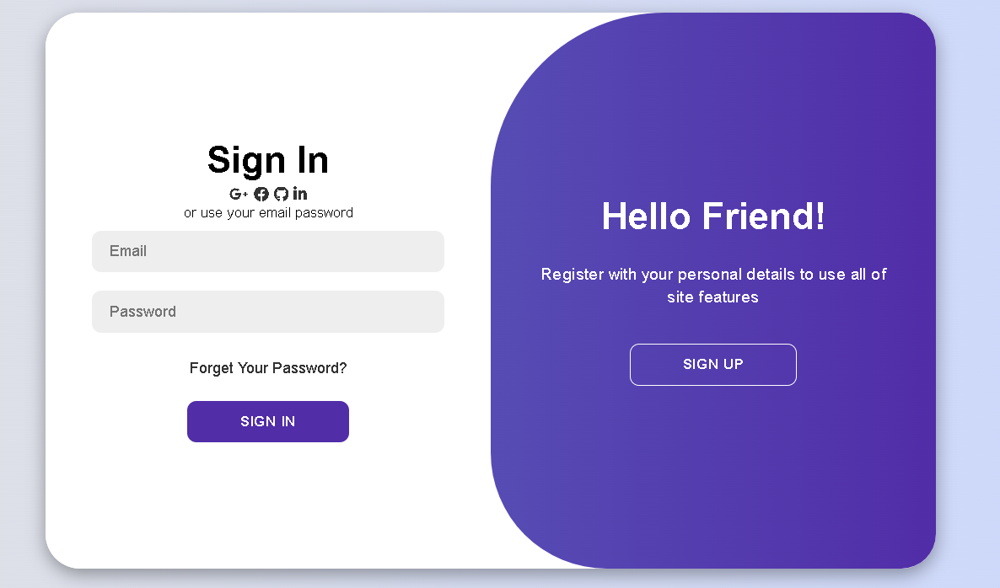

# Animated Login Page  

An elegant and interactive login page with smooth animations, built using HTML, CSS, and JavaScript. This project showcases a modern UI design with responsive functionality, making it suitable for various devices.  

## Features  
- **Beautiful Animations:** Smooth transitions for a visually appealing user experience.  
- **Responsive Design:** Fully adaptable to different screen sizes, from desktops to mobile devices.  
- **Clean Code:** Well-organized and easy-to-understand code structure.  

## Technologies Used  
- **HTML:** For the basic structure of the login page.  
- **CSS:** For styling and animations.  
- **JavaScript:** For interactive elements.  

## Demo  
[Insert a link here if you deploy the page using GitHub Pages or any other hosting service.]  

## Preview  

## Getting Started  
1. Clone the repository:  
     
   git clone https://github.com/itsalokbarnwal/Animated-Login-Page.git
  
2. Open `index.html` in any web browser to view the login page.  

## How to Use  
- This project can be integrated into any web application requiring a login functionality.  
- Customize the colors, animations, or layout as per your project requirements.  

## Contributing  
Feel free to fork this repository, make your changes, and submit a pull request. Contributions are always welcome!  

## License  
This project is licensed under the MIT License.  

## Connect with Me  
- **LinkedIn:** [https://www.linkedin.com/in/alokbarnwal-webdev]  
- **GitHub:** [https://github.com/itsalokbarnwal]  

